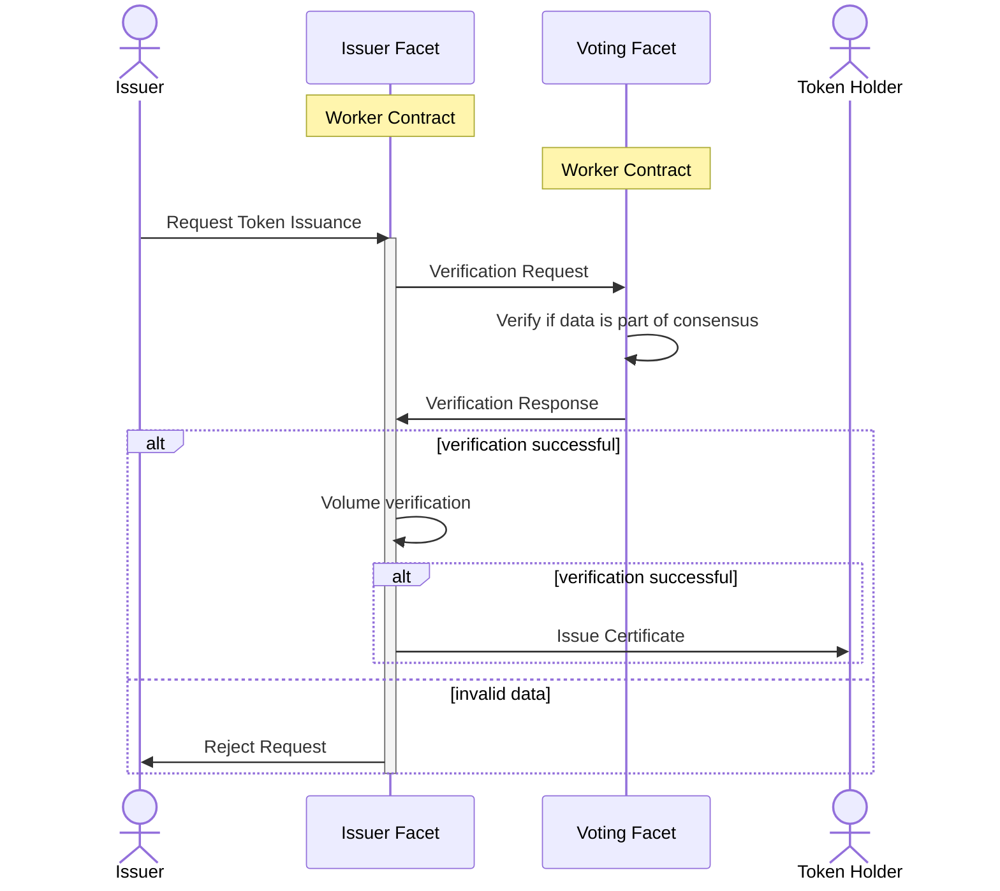

# Energy Web Worker Contract

Collection of packages from Energy Web to create Green Proof applications.

The Worker Contract enables anyone to build and run a digital tracking system for clean energy by leveraging decentralization easily and quickly. Primary components in this repo include  
1. Example of a decentralized logic execution for verifying data input and logic for creating digital proofs of clean energy
2. Smart contracts on Energy Web Chain (EWC) for creating verifiable digital proofs representing clean energy

An ideal user of Green Proofs is a platform operator with the following problem: “I am an organization trying to generate a digital representation of proof of greenness  but I cannot generate a green proof that is trusted by the community because there is no system that efficiently identifies and authorizes actors AND enables trusted data to enter the system.”

List of packages:

1. [@energyweb/algorithms-24-7](./packages/algorithms/)
2. [@energyweb/ddhub-client](./packages/ddhub-client/)
3. [@energyweb/contracts](./packages/contracts/)
4. [@energyweb/merkle-tree](./packages/merkle-tree/)
5. [@energyweb/overseer](./packages/overseer/)
6. [@energyweb/worker](./packages/worker/)

Examples of decentralized worker implementation:

1. [24/7 Energy Matching](./packages/worker-example/)

Smart Contract successfully passed a smart contract [audit](./docs/smart_contract_audit.pdf) by Hacken in February 2023.

## Flows

### 1. Reaching Consensus


### 2. Green Proof Issuance

## Development

### Prepare workspace packages
```shell
yarn purge && yarn && yarn build
```

## Release

We maintain two distribution channels: *latest* and *next*.
*next* can be treated as *alpha*. To release particular channel use branch:

Channel | Branch
--- | ---
next | `next`
master | `master`

### Local

1. Create personal access token on GitHub: https://github.com/settings/tokens
2. Set this token as `GH_TOKEN` env variable (or just prefix command below with `GH_TOKEN=xxxxx [...]`)
2. Run `yarn release`

### Github

1. Go to Github Actions
2. Select "Release" from the workflow list  
3. Run it manually using "Run workflow" button, and select branch for given channel (see above)
